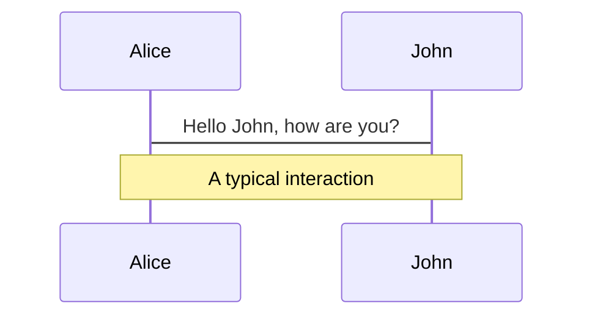
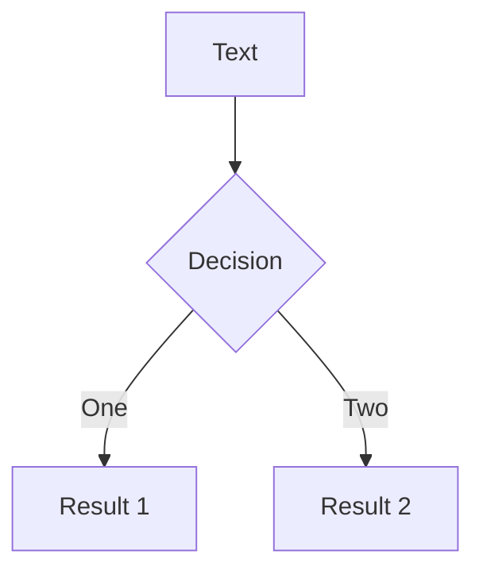
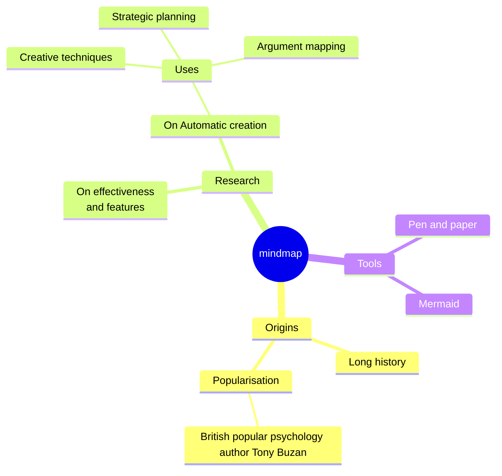
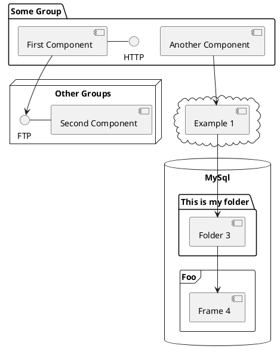

---
# try also 'default' to start simple
theme: seriph
# random image from a curated Unsplash collection by Anthony
# like them? see https://unsplash.com/collections/94734566/slidev
background: https://media2.giphy.com/media/v1.Y2lkPTc5MGI3NjExbTR5djB2ajkzazdnMm8zYmFmYWZmcnVjbDIwNGVwcmk1MG9zd2NjMCZlcD12MV9pbnRlcm5hbF9naWZfYnlfaWQmY3Q9Zw/VGK2WUT3amXjG/giphy.gif
# some information about your slides (markdown enabled)
title: Welcome to Slidev
info: |
  ## Slidev Starter Template
  Presentation slides for developers.

  Learn more at [Sli.dev](https://sli.dev)
# apply UnoCSS classes to the current slide
class: text-center
# https://sli.dev/features/drawing
drawings:
  persist: false
# slide transition: https://sli.dev/guide/animations.html#slide-transitions
transition: slide-left
# enable MDC Syntax: https://sli.dev/features/mdc
mdc: true
# duration of the presentation
duration: 35min
---

# Hjerterytmemåler(PPG)

Av Joseph GT og Yosyas YW

<!--
The last comment block of each slide will be treated as slide notes. It will be visible and editable in Presenter Mode along with the slide. [Read more in the docs](https://sli.dev/guide/syntax.html#notes)

photoplethysmograph
-->

---
transition: fade-out
---

# Fysikken
.


<style>
h1 {
  background-color: #2B90B6;
  background-image: linear-gradient(45deg, #4EC5D4 10%, #146b8c 20%);
  background-size: 100%;
  -webkit-background-clip: text;
  -moz-background-clip: text;
  -webkit-text-fill-color: transparent;
  -moz-text-fill-color: transparent;
}
</style>

<!--
Fysikken: Hvordan oversetter sensoren en fysisk egenskap til elektrisitet? (Tegn gjerne på tavla: elektroner, magnetfelt, ioner).
-->

---
transition: fade-out
---

# Fysikken
.

<iframe src="/2.html" style="width: 100%; height: 85%"></iframe>

<style>
h1 {
  background-color: #2B90B6;
  background-image: linear-gradient(45deg, #4EC5D4 10%, #146b8c 20%);
  background-size: 100%;
  -webkit-background-clip: text;
  -moz-background-clip: text;
  -webkit-text-fill-color: transparent;
  -moz-text-fill-color: transparent;
}
</style>

<!--
It is the combination of photo diode and transistor. The current produced by the photo diode is low, so it is sent through the transistor
and amplified
-->

---
transition: slide-up
level: 2
---

# Hvordan fungerer kretsen

.

</img>

<!--
Trinn 1: Transduser-trinnet (Fra lys til strøm)
Kretsen starter med en transduser bestående av en IR-LED og en fototransistor. LED-en sender infrarødt lys gjennom fingeren, mens fototransistoren måler hvor mye lys som slipper gjennom. Siden blod absorberer lys, vil spenningen over 10kΩ-motstanden variere i takt med hjerteslagene dine.

Trinn 2: Filtrering av DC-offset (Høypassfilter)
Signalet fra fingeren inneholder mye uinteressant informasjon fra fast vev og bein (DC-offset). Vi bruker en 4.7µF kondensator som et høypassfilter. Den blokkerer den konstante spenningen og slipper kun gjennom de raske endringene som utgjør selve pulssignalet (AC-komponenten).

Trinn 3: Etablering av virtuell jord (Biasing)
Arduinoen kan kun måle positive spenninger (0–5V). For å hindre at den negative delen av pulsbølgen blir kuttet, lager vi en virtuell jord ved hjelp av to 100kΩ motstander i en spenningsdeler. Dette løfter signalet til et nullpunkt på 2.5V, slik at pulsen kan svinge fritt både opp og ned midt i måleområdet.

Trinn 4: Aktiv forsterkning (Gain)
Det rå signalet fra fingeren er svært svakt (millivolt). Vi bruker en LM358 operasjonsforsterker (Op-Amp) i en ikke-inverterende konfigurasjon. Forholdet mellom motstandene på 100kΩ og 1kΩ gir oss en Gain (forsterkning) på ca. 100. Dette gjør signalet sterkt nok til at Arduinoen kan behandle det med høy nøyaktighet.

Trinn 5: Støyreduksjon og signal-støy-forhold (Lavpassfilter)
For å få en ren kurve bruker vi en 100nF kondensator over forsterkeren som et lavpassfilter. Dette fjerner høyfrekvent elektrisk støy (f.eks. 50Hz fra strømnettet). Dette forbedrer kretsens signal-støy-forhold, slik at Arduinoens A0-inngang mottar en glatt og tydelig hjerterytme uten "rusk" i signalet.
-->

---
transition: slide-up
level: 2
---

# Hvorfor valgte vi akkurat den motstanden?


<!--
220Ω (ved IR LED): Dette er en strømbegrensende motstand. Uten denne ville LED-en trukket for mye strøm fra 5V-kilden og brent ut. Valget på 220Ω gir en strøm på ca. 17-20mA, som er sterkt nok til å lyse gjennom hud og vev, men trygt for komponenten.


10kΩ (ved fototransistoren): Denne fungerer som en lastmotstand. Den danner en spenningsdeler sammen med fototransistoren. Verdien 10kΩ er valgt for å gi en god balanse mellom følsomhet og responstid. Den gjør om små endringer i lysstyrke til målbare endringer i spenning.


100kΩ og 1kΩ (ved Op-Ampen): Disse bestemmer forsterkningen (Gain). Formelen for en ikke-inverterende forsterker er 
Gain = 1+(R_feedback/R_in). Med 100kΩ og 1kΩ får vi en forsterkning på ca. 101 ganger. Dette er nødvendig fordi det rå signalet fra hjerteslagene ofte bare er noen få millivolt, og vi vil ha det opp i "volt-skalaen" (0-5V) så Arduinoen får god oppløsning.
-->

---
transition: slide-up
level: 2
---

# Hvorfor trenger vi en kondensator

<h2>

$f_c = \frac{1}{2\pi RC}$
</h2>


<!--
Kretsen bruker kondensatorer til tre forskjellige, kritiske oppgaver:

DC-blokkering (4.7µF): Signalet fra fototransistoren har en stor "DC-offset" (en konstant spenning fra bakgrunnslys og vev) og en bitteliten "AC-del" (selve pulsen). Kondensatoren på 4.7µF fungerer som et høypassfilter. Den fjerner den konstante spenningen og lar bare de raske endringene (hjerteslagene) slippe igjennom til forsterkeren.

1. Hvorfor 4.7µF på inngangen? (Høypassfilteret)
(Pek på kondensatoren til venstre)
"Et hjerte slår vanligvis mellom 40 og 200 slag i minuttet**.
Omregnet til Hertz er dette ca 0.7 Hz til 3.3 Hz.

"Her bruker vi en kondensator på 4.7 mikrofarad sammen med motstandene. Dette bestemmer den nedre grensen for hva vi måler."
"Vi bruker formelen for grensefrekvens: $f = \frac{1}{2\pi RC}$."
"Når vi setter inn verdiene (4.7 mikrofarad og 50 kilo-ohm), får vi en grense på 0.68 Hz."
Hvorfor er dette viktig?
"0.68 Hz tilsvarer ca 40 hjerteslag i minuttet."
"Hadde vi valgt en mindre kondensator, ville grensen blitt høyere, og vi ville ikke klart å måle pulsen på en som er rolig. 4.7µF er altså valgt for å slippe gjennom selv lave hjerteslag."


Støyfiltrering (100nF Keramisk): Denne sitter i parallell med tilbakemoblingsmotstanden. Den fungerer som et lavpassfilter. Hjerteslag er lavfrekvente (ca. 1-3 Hz). Denne kondensatoren fjerner høyfrekvent støy fra lysrør i rommet eller elektrisk støy i kretsen, slik at signalet blir "mykere" og lettere å lese for Arduinoen.

4. Hvorfor 100nF over forsterkeren? (Feedback)**
(Pek på den lille kondensatoren over LM358)*

"Til slutt har vi en liten 100 nanofarad kondensator i tilbakekoblingen."
"Denne fungerer som en støtdemper for forsterkeren."
"Den hindrer at operasjonsforsterkeren begynner å svinge av seg selv (oscillere) på grunn av rask støy. Den sikrer rett og slett at kretsen er stabil."


Stabilisering (100µF): Denne sørger for at forsterkeren holder seg stabil på det nivået vi har satt som "nullpunkt" (bias), slik at vi ikke forsterker opp uønsket støy fra strømforsyningen.

3. Hvorfor 100µF før Op-Ampen? (Lavpassfilteret)
(Pek på kondensatoren rett før Op-Amp)

"Her har vi et lavpassfilter med en 100 mikrofarad kondensator og 1kΩ motstand."
"Igjen bruker vi formelen: $f = \frac{1}{2\pi RC}$."
"Med disse verdiene havner grensen på ca 1.6 Hz."
Hvorfor så lavt?
"Dette er et aggressivt filter. 1.6 Hz tilsvarer rundt 100 slag i minuttet."
"Fordelen er at det fullstendig dreper 50 Hz-støy fra strømnettet og lamper i rommet."
"Det gir oss en veldig ren og fin kurve for hvilepuls, som var målet vårt."
-->

---
transition: slide-up
level: 2
---

# Hvorfor trenger vi en Op-Amp (LM358)


<!--
Op-Ampen er "hjertet" i signalbehandlingen av to grunner:

Forsterkning: Som nevnt er det rå signalet fra fingeren altfor svakt til at Arduinoens analoge inngang (A0) kan tolke det nøyaktig. Op-Ampen løfter signalet slik at et hjerteslag gir et tydelig utslag i grafen.

Impedans-matching (Buffer): En Op-Amp har veldig høy inngangsimpedans. Det betyr at den kan "føle" spenningen fra fototransistoren uten å belaste den eller stjele strøm fra signalet. Samtidig har den lav utgangsimpedans, som gjør at den kan levere et stabilt og sterkt signal rett inn i Arduinoens A0-pinne uten at signalet taper seg.
-->

---
transition: slide-up
level: 2
---

# Hvordan fungerer kretsen
<iframe src="/1.html" style="width: 100%; height: 100%;"></iframe>

<!--
Kretsen fungerer ved å sende infrarødt lys gjennom fingeren (IR LED). En fototransistor fanger opp lyset som slipper igjennom. Når hjertet slår, endres blodvolumet i fingeren, noe som endrer mengden lys som treffer transistoren. Dette skaper et veldig svakt elektrisk signal som vi må behandle før Arduinoen kan lese det.
-->

---
transition: slide-up
level: 2
---

# DEMO

.

</img>

<!--
Kretsen fungerer ved å sende infrarødt lys gjennom fingeren (IR LED). En fototransistor fanger opp lyset som slipper igjennom. Når hjertet slår, endres blodvolumet i fingeren, noe som endrer mengden lys som treffer transistoren. Dette skaper et veldig svakt elektrisk signal som vi må behandle før Arduinoen kan lese det.
-->

---
transition: fade
level: 2
---

# Grafen

<iframe src="/3.html" style="width: 100%; height: 95%;"></iframe>

<!--
Vis grafene: Presenter dataene dere har logget i et punktdiagram (scatter plot). Husk aksenavn og enheter!
-->

---

# Tolkning


<iframe src="/3.html" style="width: 100%; height: 95%;"></iframe>

<!--
Tolkning: Hva ser vi? Er sammenhengen lineær eller ikke-lineær?
-->

---
class: px-20
layout: image
image: https://up.jooo.tech/98c7
---

<!--
Databehandling: Var rådataene fulle av stØy? Vis gjerne en graf «fØr og etter» dere la inn et
filter (f.eks. gjennomsnitt eller median) i koden.
-->

---
class: px-20
---

# Feilkilder
## Relabilitet?
## Validitet?

<!--
Reliabilitet: Hvor mye «hopper» målingene (stØy)? Hva er kilden?

Validitet: Måler dere egentlig det dere tror? (Systematiske feil).
-->

---

# Hva var det vanskeligste?

<br>

# Hva ville dere gjort annerledes i «versjon 2.0»?

---

# Motions

Motion animations are powered by [@vueuse/motion](https://motion.vueuse.org/), triggered by `v-motion` directive.

```html
<div
  v-motion
  :initial="{ x: -80 }"
  :enter="{ x: 0 }"
  :click-3="{ x: 80 }"
  :leave="{ x: 1000 }"
>
  Slidev
</div>
```

<div class="w-60 relative">
  <div class="relative w-40 h-40">
    
    
    
  </div>

  <div
    class="text-5xl absolute top-14 left-40 text-[#2B90B6] -z-1"
    v-motion
    :initial="{ x: -80, opacity: 0}"
    :enter="{ x: 0, opacity: 1, transition: { delay: 2000, duration: 1000 } }">
    Slidev
  </div>
</div>

<!-- vue script setup scripts can be directly used in markdown, and will only affects current page -->
<script setup lang="ts">
const final = {
  x: 0,
  y: 0,
  rotate: 0,
  scale: 1,
  transition: {
    type: 'spring',
    damping: 10,
    stiffness: 20,
    mass: 2
  }
}
</script>

<div
  v-motion
  :initial="{ x:35, y: 30, opacity: 0}"
  :enter="{ y: 0, opacity: 1, transition: { delay: 3500 } }">

[Learn more](https://sli.dev/guide/animations.html#motion)

</div>

---

# $\LaTeX$

$\LaTeX$ is supported out-of-box. Powered by [$\KaTeX$](https://katex.org/).

<div h-3 />

$\sqrt{3x-1}+(1+x)^2$

Block
$$ {1|3|all}
\begin{aligned}
\nabla \cdot \vec{E} &= \frac{\rho}{\varepsilon_0} \\
\nabla \cdot \vec{B} &= 0 \\
\nabla \times \vec{E} &= -\frac{\partial\vec{B}}{\partial t} \\
\nabla \times \vec{B} &= \mu_0\vec{J} + \mu_0\varepsilon_0\frac{\partial\vec{E}}{\partial t} \\
333333_2
\end{aligned}
$$

[Learn more](https://sli.dev/features/latex)

---

# Diagrams

You can create diagrams / graphs from textual descriptions, directly in your Markdown.

<div class="grid grid-cols-4 gap-5 pt-4 -mb-6">









</div>

Learn more: [Mermaid Diagrams](https://sli.dev/features/mermaid) and [PlantUML Diagrams](https://sli.dev/features/plantuml)

---
foo: bar
dragPos:
  square: 691,32,167,_,-16
---

# Draggable Elements

Double-click on the draggable elements to edit their positions.

<br>

###### Directive Usage

```md

```

<br>

###### Component Usage

```md
<v-drag text-3xl>
  <div class="i-carbon:arrow-up" />
  Use the `v-drag` component to have a draggable container!
</v-drag>
```

<v-drag pos="663,206,261,_,-15">
  <div text-center text-3xl border border-main rounded>
    Double-click me!
  </div>
</v-drag>


###### Draggable Arrow

```md
<v-drag-arrow two-way />
```

<v-drag-arrow pos="67,452,253,46" two-way op70 />

---
src: ./pages/imported-slides.md
hide: false
---

---

# Monaco Editor

Slidev provides built-in Monaco Editor support.

Add `{monaco}` to the code block to turn it into an editor:

```ts {monaco}
import { ref } from 'vue'
import { emptyArray } from './external'

const arr = ref(emptyArray(10))
```

Use `{monaco-run}` to create an editor that can execute the code directly in the slide:

```ts {monaco-run}
import { version } from 'vue'
import { emptyArray, sayHello } from './external'

sayHello()
console.log(`vue ${version}`)
console.log(emptyArray<number>(10).reduce(fib => [...fib, fib.at(-1)! + fib.at(-2)!], [1, 1]))
```

---
layout: center
class: text-center
---

# Learn More

[Documentation](https://sli.dev) · [GitHub](https://github.com/slidevjs/slidev) · [Showcases](https://sli.dev/resources/showcases)

<PoweredBySlidev mt-10 />
duce(fib => [...fib, fib.at(-1)! + fib.at(-2)!], [1, 1]))
```

---
layout: center
class: text-center
---

# Learn More

[Documentation](https://sli.dev) · [GitHub](https://github.com/slidevjs/slidev) · [Showcases](https://sli.dev/resources/showcases)

<PoweredBySlidev mt-10 />
